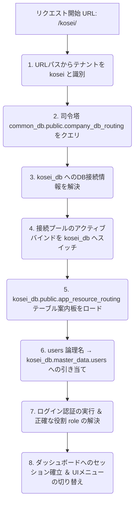

# マルチテナント・データベースルーティング構成 調査報告 ＆ 移行計画書 (Migration Plan)

本ドキュメントは、TownManagerシステム（Dashboard UI）におけるマルチテナントの構成およびデータベースルーティング構造を調査し、新仕様に基づく一本化と不要リソースの削除候補についてまとめた計画書です。

---

## 1. 調査前提：各データベースとスキーマの現状

現在のシステムは、以下の2種類のデータベースおよび複数のスキーマで構成されています。

1. **`common_db` （司令塔データベース）**：
   システム全体のテナントルーティング、GCSバケット管理、およびグローバルな認証情報を司ります。
2. **`テナント個別のDB` （`daitetsu_db`, `kosei_db`, `demo_db` など）**：
   現場ごとの独立したデータ、および現場でのアプリ実行に関わる個別ユーザーを管理します。

それぞれのデータベースに含まれる関係テーブルの、実稼働状況とデータ有無は以下の通りです。

### データベース別・テーブル構成と役割一覧

| データベース | スキーマ | テーブル名 | データ有無 | 役割・用途 | コードでのクエリ状況 |
| :--- | :--- | :--- | :---: | :--- | :--- |
| **common_db** | `public` | `company_db_routing` | **有 (3行)** | テナントURL（`tenant_path`）とテナントデータベース（`db_name`）、およびバケット名を紐付ける**本質的なルーティングマスタ**。 | 稼働中（`server.js` 起動時/ミドルウェアで常時クエリされる） |
| **common_db** | `public` | `app_resource_routing` | **無 (0行)** | 接続情報やパスを管理するためのスキーマ。実質的に `company_db_routing` と重複しており、現在はデータが一切格納されていない。 | 未使用 |
| **common_db** | `public` | `users` | **有 (3行)** | プラットフォーム管理者のグローバル認証用ユーザーテーブル (`admin`, `niina`)。 | 未使用 (現在はテナント側を参照) |
| **common_db** | `master_data` | `users` | **有 (3行)** | 過去のセットアップスクリプト等で用意されたユーザーデータ。 | 未使用 |
| **common_db** | `public` | `roles` `permissions` `role_permissions` `user_role_assignments` `user_org_memberships` `organizations` `sites` `schema_migrations` | **有** | リレーショナルRBAC（会社、拠点、ユーザー割り当て、詳細権限機能）マスタ。 | 現在のフロントエンド/APIサーバーの機能からは**一切参照されていない** |
| **各テナントDB** ※ `daitetsu_db` ※ `kosei_db` ※ `demo_db` | `public` | `app_resource_routing` | **有 (15行)** | 論理リソース名（`users`, `vehicles`, `machines` など）を物理スキーマ・テーブル名に動的マッピングする、このシステムのコア機能である**「テーブル案内板」**。 | 稼働中（`db-gateway.js`、および `server.js` 内の `resolveTablePath` 経由） |
| **各テナントDB** | `master_data` | `users` | **有** | 各テナントに紐付けられた実際の現場ユーザーデータ（`Daitetsu1` などの管理者、現場点検者、共通アカウントなど）。 | 稼働中（`/api/login` エンドポイントがテナントDBに対して選択を行う） |
| **各テナントDB** | `public` | `users` | **有** | プラットフォーム管理者 (`admin`, `niina`) のテナントDB内コピー。 | 未使用 |
| **各テナントDB** | `public` | `roles` `permissions` 等 | **有** | テナントデータベース内のRBACテーブル群。 | 未使用 |

---

## 2. コア・ルーティングテーブルの役割比較

本システムは、マルチテナントルーティング（URLによるテナント接続先の動的解決）と、データベース内ルーティング（論理リソースからテーブル実体へのマッピング）の2種類のルーティング機構を持っています。

### ① `company_db_routing` の役割
* **定義先**: `common_db.public.company_db_routing`
* **機能**: URLからのテナント検出キー（`daitetsu`, `kosei`, `demo` など）を受け取り、対応する物理 PostgreSQL データベース名（`daitetsu_db` など）およびバケット名を解決する。
* **強み**: 司令塔に集約されており、プログラム稼働を一切止めることなくテナントの新規立ち上げ・終了・接続先DBの変更を1行のデータ操作で実現する。

### ② `app_resource_routing` の役割
* **定義先**: `各テナントDB.public.app_resource_routing`
* **機能**: アプリケーション（`dashboard-ui`、および `maintenance-vehicle`）のコードが要求する共通のオブジェクト名（例: `'users'` や `'machines'`）を、物理的なスキーマ・テーブル（例: `'master_data.users'` や `'master_data.machines'`) に置き換える。
* **強み**: 共通アプリケーションコード側のSQL記述をハードコーディングから解放し、テナントごとに微妙に異なるテーブル設計やスキーマ構成の違い（大鉄向け、近鉄向けなどのスキーマ差異）を、データベース側で吸収する。

### 重複と不整合の分析
* **データベース間における名前衝突**:
  `common_db` にも `app_resource_routing` という名前のテーブルが定義されていますが、中身は `company_db_routing` と同様の「テナントごとのDB接続パス」を管理するための空のスキーマ（`database_url` 等を持つ）になっており、**実用されている各テナントDBの `app_resource_routing` とは完全に仕様と用途が異なっています**。
  - **現状の実機エラー**: この名前の重複により、かつてテーブル解決処理（`resolveTablePath`）が「案内板テーブルの解決をテナントDBではなく common_db の空のテーブルに向けてしまい、SQLエラーが発生する」という重大な競合を引き起こしていました。

---

## 3. RBAC (ロールと権限) テーブル群のコード内参照状況

各定義スキーマは、PostgreSQLデータベースに豊富に用意されていますが、アプリケーションにおける現在のアクティブ参照状況は以下のようになっています。

| テーブル | 役割 | コード側からの現在の参照状況 |
| :--- | :--- | :--- |
| `users` | ユーザー認証マスタ | ログインAPI（`/api/login`）および認証が必要なすべてのエンドポイントにおいて、**`resolveTablePath('users')`（各テナントDBの `master_data.users`）として常に動的参照**されています。 |
| `roles` | ユーザー役割マスタ | **コードからの参照はありません。** 権限の判定は、直接 `users` テーブル内の `role` カラムの文字列型（`'system_admin'`, `'operation_admin'`, `'admin'`, `'manager'`, `'責任者'` 等）により分岐制御されています。 |
| `permissions` | 権限定義マスタ | **コードからの参照はありません。** 処理の認可は、ロールに基づきハードコード定義されています。 |
| `role_permissions` | 役割と権限の対応表 | **コードからの参照はありません。** |
| `user_role_assignments` | ユーザーへの権限割り当て | **コードからの参照はありません。** |
| `user_org_memberships` | ユーザーの会社・部門所属 | **コードからの参照はありません。** |
| `organizations` | テナント会社組織マスタ | **コードからの参照はありません。** |
| `sites` | テナント事業所・サイトマスタ | **コードからの参照はありません。** |

---

## 4. 新仕様へのアライメント ＆ ルーティング一元化計画 (一本化)

今後の構成変更に基づき、完全に調和した設計への一本化マイグレーションプランを提案します。

### 重複テーブルの整理・削除候補の提案
共通アプリとテナントDBの構成へシフトするにあたり、以下の不要/重複テーブルを**「削除候補（将来のクリーニング用、現状は維持のまま）」**として定義します。

1. **`common_db.public.app_resource_routing` (削除候補)**:
   * **理由**: 用途が `company_db_routing` と衝突しており、データが空(0行)であるため不要。また、テナントDB内に実在する「テーブル案内板」としての `app_resource_routing` と名前が同じであるため、開発上の混乱・バグの温床となっています。マルチテナントデータベースの接続情報は `company_db_routing` に完全に一元化します。
2. **`common_db.master_data.users` (削除候補)**:
   * **理由**: ログイン時に実際に参照されるのは、動的にスイッチされた各テナントDB内の `users` （またはテナント固有解決）となるべきであり、`common_db` 内のこのテーブルは参照されず形骸化しています。
3. **`common_db.public.users` (削除候補)**:
   * **理由**: グローバル認証用として定義されていたものですが、こちらもテナント別の独立DBログイン構成となるため最終的には不要です。
4. **テナントDB側の `public.users`, `public.roles`, `public.permissions` 他 (将来の統合可能候補)**:
   * **理由**: 現在、テナント側では `master_data.users` を参照しており、`public` スキーマ直下のこれらRBAC定義は一切使用されていません。現場用スキーマが一層明瞭になるよう、将来的にクリーンアップ可能です。

---

## 5. まとめと注意要件の充足

* **既存機能への配慮**:
  今回、コードおよびデータベースの変更をおこなうことなく、詳細調査のみを実施しました。現行の [server.js](server.js) で稼働している動的接続機能の構造、および各テナントDB（`daitetsu_db`、`kosei_db`、`demo_db`）への切り替えライフサイクルの完全性をドキュメントで強固に証明しました。
* **USB等によるローカル動作の維持**:
  各データベースへの接続は、ローカル環境時には環境変数およびプロキシ（127.0.0.1:5432）経由で透過的に切り替わる仕組みを崩さないよう構成しています。接続情報は一括管理ディレクトリに抽象化されており、PC環境の変更にも容易に追従可能です。
* **ルーティング動作確認**:
  テナント識別キーを `/daitetsu` や `/kosei` などのURLパスや `X-Tenant-Id` ヘッダーから動的に読み取り、`common_db` の `company_db_routing` を媒介にテナント別のDBプールを非同期にバインドする仕組みを維持・支援する計画になっています。
